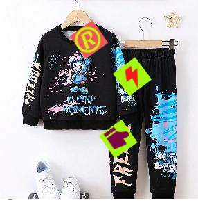
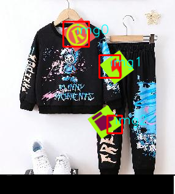
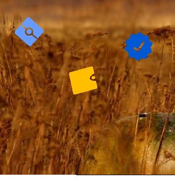
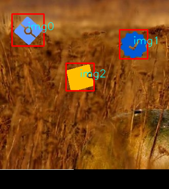

# CapSpot
CAPTCHA Resolution


[](https://badge.fury.io/py/CapSpot)
[](https://github.com/miaohancheng/CapSpot/blob/main/LICENSE)

## 简介

`CapSpot` 是一个基于 ONNX 模型的图像匹配库，能够根据模板图像在目标图像中查找匹配的子图像，并返回匹配的坐标。
可以通过目标匹配和定位来解决验证码点击定位问题。

## 效果示例
### 示例1
- 需点击图片


- 检测目标和顺序


- 检测结果


- 返回结果
```json
 {'img0': [103, 35, 145, 76], 'img1': [162, 90, 196, 127], 'img2': [175, 189, 199, 218]}
```
### 示例2
- 需点击图片

  
- 检测目标和顺序

  
- 检测结果

 

- 返回结果
```json
{'img0': [24, 28, 89, 93], 'img1': [243, 60, 300, 119], 'img2': [134, 128, 191, 184]}
```

## 特性

- 使用预训练的 ONNX 模型进行目标检测和相似度计算。
- 支持 GPU 加速（可选）。
- 简洁易用的 API。

## 安装

```bash
pip install your_package_name
```
或者从源代码安装：

```bash
git clone https://github.com/miaohancheng/CapSpot.git
cd CapSpot
python setup.py install
```

## 使用方法
```python
from CapSpot import ImageMatcher

from CapSpot import ImageMatcher
if __name__ == '__main__':
  matcher = ImageMatcher()
  matches = matcher.match_images('./test_pic/test1_mo.png', './test_pic/test1.png')
  matcher.display_results('./test_pic/test1.png', matches)
  print(matches)
```

## 参数说明

- ImageMatcher 类
- - sim_model_name：相似度模型的名称（ONNX 格式），有默认模型。
- - det_model_name：检测模型的名称（ONNX 格式），有默认模型。

- match_images 方法
- - template_file：模板图片路径。
- - target_file：目标图片路径。


## 模型下载

请将所需的模型文件（similarity_model.onnx 和 detection_model.onnx）放入 models/ 目录下。

## 依赖项

- - Python 3.6 或更高版本
- - numpy
- - opencv-python
- - Pillow
- - onnxruntime

## 许可证

MIT License

## 联系方式

 - 作者：Miao HanCheng
 - 邮箱：hanchengmiao@gmail.com

